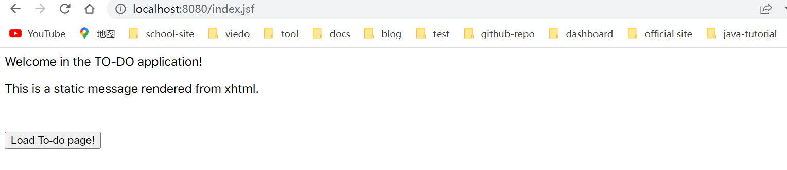

## 1. 概述

JavaServer Faces是一个服务器端、基于组件的用户界面框架，它最初是作为Jakarta EE的一部分开发的。

在本教程中，我们学习如何将JSF集成到Spring Boot应用程序中。作为一个Demo，我们将实现一个简单的应用程序来创建一个TO-DO列表。

## 2. Maven依赖

```xml
<dependency>
    <groupId>org.apache.tomcat.embed</groupId>
    <artifactId>tomcat-embed-jasper</artifactId>
</dependency>
<!--JSF-->
<dependency>
    <groupId>org.glassfish</groupId>
    <artifactId>javax.faces</artifactId>
    <version>2.3.7</version>
</dependency>
```

javax.faces依赖包含JSF API以及实现。

## 3. 配置JSF Servlet

JSF框架使用XHTML文件来描述用户界面的内容和结构，服务器端根据XHTML描述生成JSF文件。

我们首先在src/main/webapp目录下的index.xhtml文件中创建一个静态结构：

```xhtml
<f:view xmlns="http://www.w3c.org/1999/xhtml"
        xmlns:f="http://java.sun.com/jsf/core"
        xmlns:h="http://java.sun.com/jsf/html">
    <h:head>
        <meta charset="utf-8"/>
        <meta http-equiv="X-UA-Compatible" content="IE=edge,chrome=1"/>
        <title>TO-DO application</title>
    </h:head>
    <h:body>
        <div>
            <p>Welcome in the TO-DO application!</p>
            <p style="height:50px">
                This is a static message rendered from xhtml.
            </p>
        </div>
    </h:body>
</f:view>
```

该内容可通过”localhost:8080/index.jsf“访问，但是请注意，如果我们现在尝试访问该内容，我们会在客户端收到错误消息：

```text
There was an unexpected error (type=Not Found, status=404). No message available
```

后端不会有任何错误消息。但即便如此，我们也可以确定**需要一个JSF Servlet来处理请求**，以及用于匹配请求和处理程序的Servlet映射。由于我们使用Spring Boot，我们可以轻松地扩展应用程序类来处理所需的配置：

```java
@SpringBootApplication
public class JsfApplication extends SpringBootServletInitializer {

    public static void main(String[] args) {
        SpringApplication.run(JsfApplication.class, args);
    }

    @Bean
    public ServletRegistrationBean servletRegistrationBean() {
        FacesServlet servlet = new FacesServlet();
        ServletRegistrationBean servletRegistrationBean = new ServletRegistrationBean(servlet, "*.jsf");
        return servletRegistrationBean;
    }
}
```

这看起来很合理，但不幸的是它仍然不能正常使用。当我们现在尝试访问”localhost:8080/index.jsf“时，我们会得到另一个错误：

```text
java.lang.IllegalStateException: Could not find backup for factory javax.faces.context.FacesContextFactory.
```

**最终，我们还需要在webapp中添加一个web.xml文件**。让我们在src/webapp/WEB-INF中创建它：

```xml
<?xml version="1.0" encoding="UTF-8"?>
<web-app xmlns="http://java.sun.com/xml/ns/javaee"
         xmlns:xsi="http://www.w3.org/2001/XMLSchema-instance"
         xsi:schemaLocation="http://java.sun.com/xml/ns/javaee
          http://java.sun.com/xml/ns/javaee/web-app_3_0.xsd"
         version="3.0">

    <servlet>
        <servlet-name>Faces Servlet</servlet-name>
        <servlet-class>javax.faces.webapp.FacesServlet</servlet-class>
        <load-on-startup>1</load-on-startup>
    </servlet>
    <servlet-mapping>
        <servlet-name>Faces Servlet</servlet-name>
        <url-pattern>*.jsf</url-pattern>
    </servlet-mapping>
    <context-param>
        <param-name>com.sun.faces.forceLoadConfiguration</param-name>
        <param-value>true</param-value>
    </context-param>
</web-app>
```

到这里，我们的配置已经完成，现在我们可以访问”localhost:/index.jsf“：

```text
Welcome in the TO-DO application!

This is a static message rendered from xhtml.
```

## 4. 实现DAO

DAO代表数据访问对象。通常，DAO类负责两个概念：封装持久层的细节和为单个实体提供CRUD接口。为了实现DAO模式，**我们首先定义一个通用接口**：

```java
public interface Dao<T> {

    Optional<T> get(int id);
    Collection<T> getAll();
    int save(T t);
    void update(T t);
    void delete(T t);
}
```

然后是该DAO操作的模型类：

```java
@Getter
@Setter
public class Todo {

    private int id;
    private String message;
    private int priority;
}
```

然后我们需要编写Dao<Todo\>的实现类。对于我们的例子，我们将使用List模拟数据库存储：

```java
@Component
public class TodoDao implements Dao<Todo> {

    private final List<Todo> todoList = new ArrayList<>();

    @Override
    public Optional<Todo> get(int id) {
        return Optional.ofNullable(todoList.get(id));
    }

    @Override
    public Collection<Todo> getAll() {
        return todoList.stream()
                .filter(Objects::nonNull)
                .collect(Collectors.collectingAndThen(Collectors.toList(), Collections::unmodifiableList));
    }

    @Override
    public int save(Todo todo) {
        todoList.add(todo);
        int index = todoList.size() - 1;
        todo.setId(index);
        return index;
    }

    @Override
    public void update(Todo todo) {
        todoList.set(todo.getId(), todo);
    }

    @Override
    public void delete(Todo todo) {
        todoList.set(todo.getId(), null);
    }
}
```

## 5. Service

DAO层的主要目标是处理持久化机制的细节，而Service层则依赖于它之上来处理业务需求。

请注意，Service类会引用Dao接口作为依赖bean：

```java
@Scope(value = "session")
@Component(value = "todoService")
public class TodoService {

    @Autowired
    private Dao<Todo> todoDao;
    private Todo todo = new Todo();

    public void save() {
        todoDao.save(todo);
        todo = new Todo();
    }

    public Collection<Todo> getAllTodo() {
        return todoDao.getAll();
    }

    public Collection<Todo> getAllTodoSortedByPriority() {
        return todoDao.getAll()
                .stream()
                .sorted(Comparator.comparingInt(Todo::getId))
                .collect(Collectors.toList());
    }

    public int saveTodo(Todo todo) {
        validate(todo);
        return todoDao.save(todo);
    }

    private void validate(Todo todo) {
        // Details omitted
    }

    public Todo getTodo() {
        return todo;
    }
}
```

在这里，Service是一个命名组件，我们将使用该名称来引用JSF上下文中的bean。并且注意这个bean的作用域范围为session，由于**Spring的内置作用域与JSF模型不同，因此值得考虑定义自定义作用域**。

## 6. Controller

就像在JSP应用程序中一样，控制器用于处理不同视图之间的导航。接下来，我们实现一个简单的控制器，它可以从index页面导航到todo列表页面：

```java
@Scope(value = "session")
@Component(value = "jsfController")
public class JsfController {

    public String loadTodoPage() {
        checkPermission();
        return "/todo.xhtml";
    }

    private void checkPermission() {
        // Details omitted
    }
}
```

**导航基于返回的名称**。因此，loadTodoPage()方法会将我们定向到todo.xhtml页面，接下来我们需要实现该页面。

## 7. 集成JSF和Spring Beans

现在让我们看看如何从JSF上下文中引用我们的组件，首先我们在index.xthml中添加一些新内容：

```xhtml
<f:view xmlns:f="http://java.sun.com/jsf/core"
        xmlns:h="http://java.sun.com/jsf/html"
        xmlns="http://www.w3c.org/1999/xhtml">
    <h:head>
        <meta charset="utf-8"/>
        <meta http-equiv="X-UA-Compatible" content="IE=edge,chrome=1"/>
        <title>TO-DO application</title>
    </h:head>
    <h:body>
        <div>
            <p>Welcome in the TO-DO application!</p>
            <p style="height:50px">
                This is a static message rendered from xhtml.
                <h:form>
                    <h:commandButton value="Load To-do page!" action="#{jsfController.loadTodoPage}"/>
                </h:form>
            </p>
        </div>
    </h:body>
</f:view>
```

这里我们在<form\>元素中引入了一个commandButton。**这很重要，因为每个UICommand元素(例如commandButton)都必须放在UIForm元素(例如表单)内**。

到这里，我们可以启动我们的应用程序并访问”localhost:8080/index.jsf：



不幸的是，当我们点击按钮时，会出现错误：

```text
There was an unexpected error (type=Internal Server Error, status=500).
javax.el.PropertyNotFoundException:
/index.xhtml @11,104 action="#{jsfController.loadTodoPage}":
Target Unreachable, identifier [jsfController] resolved to null
```

错误消息清楚地说明了问题：jsfController解析为null。相应的组件要么未创建，要么在JSF上下文中不可见。在这种情况下，后者是正确的。

**我们需要将Spring上下文与webapp/WEB-INF/faces-config.xml中的JSF上下文连接起来**：

```xml
<?xml version="1.0" encoding="UTF-8"?>
<faces-config
        xmlns="http://xmlns.jcp.org/xml/ns/javaee"
        version="2.2">
    <application>
        <el-resolver>org.springframework.web.jsf.el.SpringBeanFacesELResolver</el-resolver>
    </application>
</faces-config>
```

## 8. 与JSF中的服务交互

todo.xhtml页面有两个目的：首先，它会显示所有todo元素；其次，我们可以添加新的tode元素。为此，UI组件将直接与之前声明的Service交互：

```xhtml
<f:view xmlns:f="http://java.sun.com/jsf/core"
        xmlns:h="http://java.sun.com/jsf/html"
        xmlns="http://www.w3c.org/1999/xhtml">
    <h:head>
        <meta charset="utf-8"/>
        <meta http-equiv="X-UA-Compatible" content="IE=edge,chrome=1"/>
        <title>TO-DO application</title>
    </h:head>
    <h:body>
        <div>
            <div>
                List of TO-DO items
            </div>
            <h:dataTable value="#{todoService.allTodo}" var="item">
                <h:column>
                    <f:facet name="header"> Message</f:facet>
                    #{item.message}
                </h:column>
                <h:column>
                    <f:facet name="header"> Priority</f:facet>
                    #{item.priority}
                </h:column>
            </h:dataTable>
        </div>
        <div>
            <div>
                Add new to-do item:
            </div>
            <h:form>
                <h:outputLabel for="message" value="Message: "/>
                <h:inputText id="message" value="#{todoService.todo.message}"/>
                <h:outputLabel for="priority" value="Priority: "/>
                <h:inputText id="priority" value="#{todoService.todo.priority}"
                             converterMessage="Please enter digits only."/>
                <h:commandButton value="Save" action="#{todoService.save}"/>
            </h:form>
        </div>
    </h:body>
</f:view>
```

上面提到的两个作用是在两个单独的div元素中实现的。首先，我们使用dataTable元素来表示todoService.AllTodo中的所有值。第二个div包含一个表单，我们可以在其中修改TodoService中Todo对象的状态。

**我们使用inputText元素来接收用户输入，而第二个输入会自动转换为int**。通过commandButton，用户可以使用todoService.save将Todo对象持久化(List内存实现)。

## 9. 总结

JSF框架可以集成到Spring框架中。我们必须选择使用哪个框架来管理bean，在本文中，我们使用了Spring框架。

但是，作用域模型与JSF框架有点不同，因此我们可以考虑在Spring上下文中实现自定义作用域。